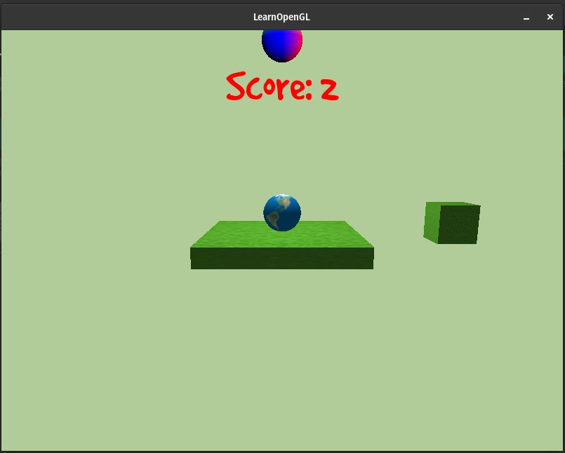

# Simple Bounce Game

Implemented using OpenGL and bullet3 Physics library



## How To Run

1. Configure:

    ```bash
    mkdir build
    cmake -B build -S .
    ```

2. Build:

    ```bash
    cmake --build build
    ```

1. Run:

    ```bash
    ./build/main
    ```
